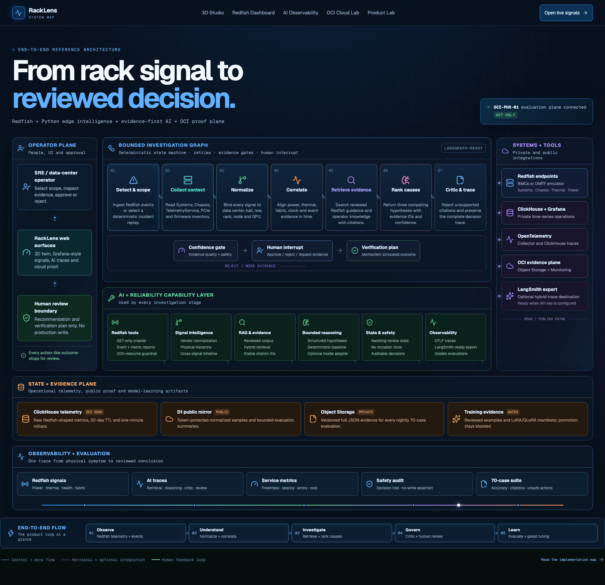
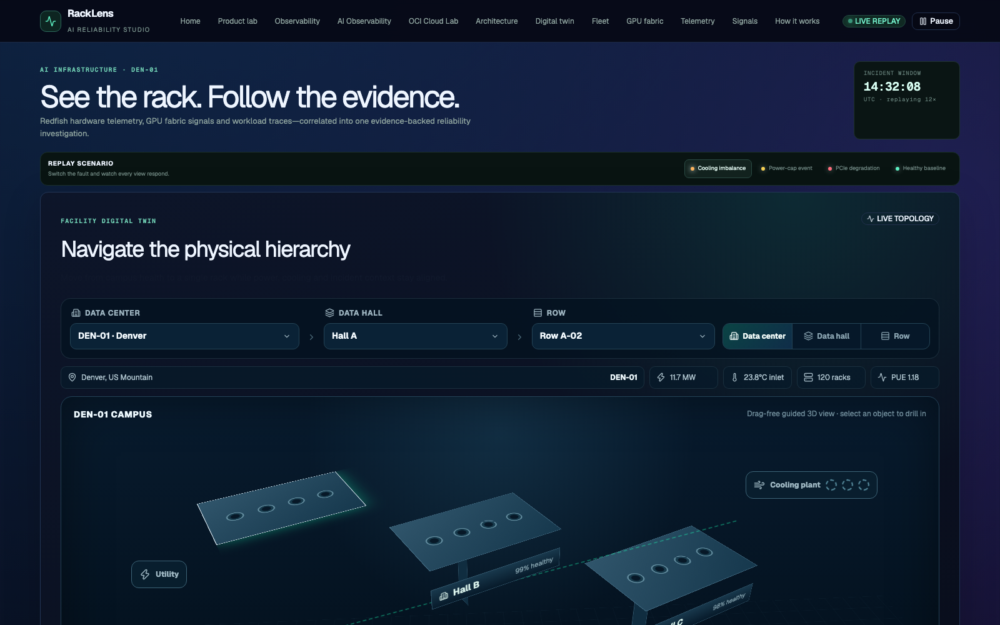
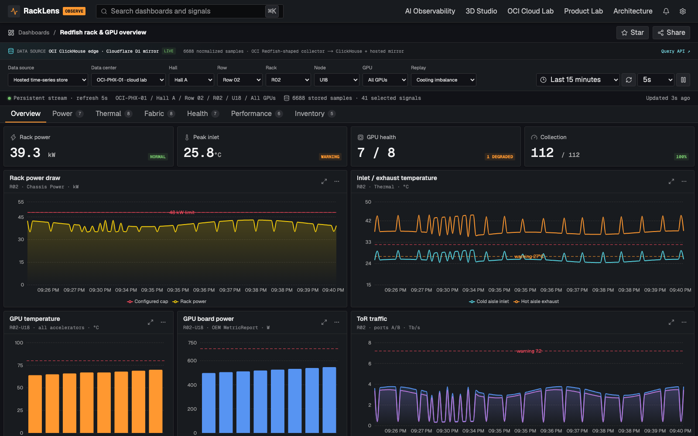
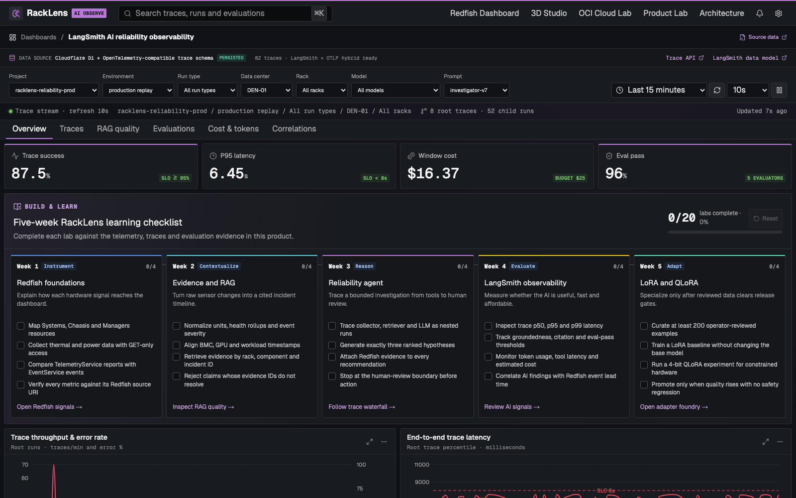
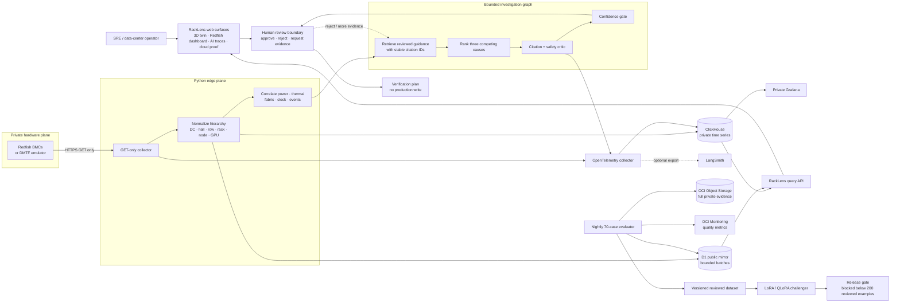

# RackLens system architecture

The animated, implementation-linked version of this map is available at the public [`/architecture`](https://racklens-ai.siva-babu.chatgpt.site/architecture) route.

## Visual flow through the live product

These screenshots are captured from the public deployment and correspond to the end-to-end flow below.

### 1. Map the complete signal-to-decision path

The architecture surface connects the operator plane, bounded investigation graph, Redfish and cloud integrations, evidence stores, observability, evaluation, and the human-review boundary.

### 2. Scope the incident in the 3D physical hierarchy

The Studio preserves data-center, hall, row, rack, server, GPU, top-of-rack switch, airflow, power, and traffic context as the operator drills into the affected asset.

### 3. Validate the underlying Redfish telemetry

The Grafana-style dashboard queries the persisted time-series path and exposes target filters, refresh controls, thresholds, legends, source provenance, and hardware signal families.

### 4. Inspect the AI trace and evaluation evidence

The AI observability surface adds nested run traces, RAG quality, evaluation results, latency, cost, token use, Redfish correlation, and safety gates so the recommendation remains reviewable.

## End-to-end product flow

Solid arrows are implemented control or data paths. Dashed arrows are feedback or optional integrations. No browser or public service connects directly to a BMC, private ClickHouse, Grafana or OCI credential.

## Component map

| Plane          | Component         | Data in                                      | Data out                                                                                      | Current status                                             |
| -------------- | ----------------- | -------------------------------------------- | --------------------------------------------------------------------------------------------- | ---------------------------------------------------------- |
| Operator       | Web surfaces      | Filters, incident selection, review decision | Visuals, cited evidence, verification plan                                                    | Implemented                                                |
| Physical       | Redfish endpoint  | Authorized read-only requests                | Systems, Chassis, Thermal, Power, TelemetryService, EventService, PCIe and firmware resources | Implemented against simulator or authorized endpoint       |
| Edge           | Python collector  | Redfish payloads or deterministic replay     | Normalized metric batches with physical hierarchy and source URI                              | Implemented                                                |
| Time series    | ClickHouse        | JSONEachRow metric batches                   | Targeted time-window queries, rollups and Grafana panels                                      | Implemented in the OCI/private stack                       |
| Public proof   | D1-hosted APIs    | Token-protected bounded batches              | Public dashboard samples and evaluation summaries                                             | Implemented                                                |
| Decision       | Reliability agent | Correlated signals plus retrieved knowledge  | Three hypotheses, evidence IDs, confidence and verification plan                              | Implemented deterministic baseline; optional model adapter |
| Tracing        | OpenTelemetry     | Collector and investigation spans            | ClickHouse trace records                                                                      | Implemented                                                |
| Hosted tracing | LangSmith         | OTLP-compatible or SDK traces                | Hosted trace inspection and evaluation                                                        | Optional; requires an API key                              |
| Cloud proof    | OCI evaluator     | Checked-in scenarios and commit SHA          | Object Storage artifact, Monitoring metrics and public summary                                | Implemented                                                |
| Specialization | Adapter pipeline  | Versioned operator-reviewed examples         | LoRA/QLoRA candidate and comparison manifest                                                  | Implemented but release-gated; no trained-model claim      |

## Investigation stages

1. **Detect and scope:** Accept a Redfish event or select a deterministic incident replay.
2. **Collect:** Read Systems, Chassis, TelemetryService, EventService, PCIe and firmware inventory.
3. **Normalize:** Bind every observation to data center, hall, row, rack, node, GPU, source URI and timestamp.
4. **Correlate:** Align power, temperature, traffic, clock and event evidence.
5. **Retrieve:** Search reviewed DMTF/operator knowledge and attach stable citation IDs.
6. **Reason:** Produce three ranked causes rather than one premature conclusion.
7. **Critic:** Reject unsupported evidence IDs and preserve the full decision trace.
8. **Review:** Save a human decision and verification plan. No Redfish write action is executed.

## Data modes

| Mode                 | Telemetry                  | Reasoning               | Intended use                     |
| -------------------- | -------------------------- | ----------------------- | -------------------------------- |
| Deterministic replay | Python simulator           | Evidence rules          | Public demo, tests and CI        |
| Live read-only       | Authorized Redfish service | Evidence rules          | Lab and operator validation      |
| Optional model       | Replay or live             | OpenAI-compatible model | Structured hypothesis comparison |

## Five-week learning-to-product map

| Week | Product capability      | Core technology                                           | Proof                                                    |
| ---- | ----------------------- | --------------------------------------------------------- | -------------------------------------------------------- |
| 1    | Redfish Capability Map  | Resource discovery, GET-only collection and normalization | Schema coverage and source URIs                          |
| 2    | Cited Incident Timeline | Hybrid RAG and structured evidence retrieval              | Every claim resolves to evidence                         |
| 3    | Reliability Copilot     | Tool-using bounded investigation graph                    | Three ranked causes and human interrupt                  |
| 4    | Replay & Evaluation Lab | Deterministic scenarios, traces and 70 golden cases       | Accuracy, citation validity, safety and latency          |
| 5    | Adapter Foundry         | PEFT LoRA and 4-bit QLoRA                                 | Blocked until 200 reviewed examples and a challenger win |

## Safety and specialization boundaries

The production Redfish client exposes `GET` only. UpdateService firmware inventory is readable, while reset, power control, configuration, firmware installation, composition and virtual-media writes are outside the connector. Approval records that a recommendation was reviewed; it never turns the recommendation into an action.

The Week 5 pipeline exports provenance-tagged records into train, validation and test splits. LoRA and 4-bit QLoRA use PEFT configurations with rank 16, alpha 32 and dropout 0.05. Promotion remains blocked until at least 200 operator-reviewed examples exist and a candidate beats the base-plus-RAG system on held-out accuracy, citation validity, safety and latency. Synthetic replay data alone cannot clear this gate.

## Production extension points

- Pinecone for a larger reviewed operations corpus
- Neo4j for rack, firmware, GPU, fabric and workload dependency graphs
- LangGraph for durable checkpoints and resumable orchestration
- LangSmith for optional hosted trace inspection
- Vendor-specific GPU telemetry adapters kept separate from the Redfish standard model
