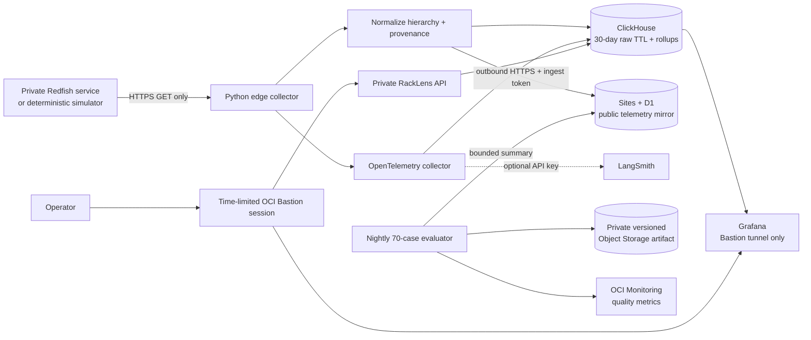

# OCI proof-plane architecture

## Data flow

The public application never connects to ClickHouse, Grafana, a BMC or OCI credentials. Its D1-backed APIs accept bounded normalized batches only when a deployment secret matches. The private instance has an egress-only public IP and operational access is through time-limited Bastion sessions.

## Trust boundaries

| Boundary               | Allowed path                                                           | Explicitly excluded                              |
| ---------------------- | ---------------------------------------------------------------------- | ------------------------------------------------ |
| BMC to edge            | Authenticated HTTPS `GET` from the collector                           | Public inbound BMC access and mutation methods   |
| Edge to private data   | Container network to ClickHouse and OpenTelemetry                      | Public ClickHouse, OTLP or Grafana listeners     |
| Edge to public proof   | Outbound HTTPS, bounded payload and ingest token                       | OCI credentials and unrestricted database access |
| Operator to instance   | OCI Bastion session scoped to the private target                       | Permanent SSH exposure to the internet           |
| Evaluation to evidence | Instance principal to compartment-scoped Object Storage and Monitoring | API keys stored in the VM, browser or repository |

## Threat model and controls

| Risk                           | Control                                                                                                                  |
| ------------------------------ | ------------------------------------------------------------------------------------------------------------------------ |
| Public BMC compromise          | No inbound BMC access; collector runs at the trusted edge and uses GET only                                              |
| OCI credential leakage         | Instance principal; no OCI API key in the VM, repo, browser or Terraform variables                                       |
| Database/admin exposure        | ClickHouse, Grafana, OTLP and FastAPI bind to loopback; access is via a time-limited Bastion session                     |
| Forged portfolio evidence      | Private full artifact, commit SHA, immutable run ID, source link and token-protected hosted summary                      |
| Autonomous unsafe action       | No Redfish mutation method exists; every case remains at a human review boundary; unsafe-action rate is a release metric |
| Cost surprise                  | Always Free-sized A1, boot volume and object footprint plus budget alerts; no paid managed service is required           |
| Secret in infrastructure state | Post-provision interactive setup writes `/etc/racklens/racklens.env` with mode `0600`                                    |

## Weeks 1–5 mapped to a real product

| Week              | OCI-backed product proof                                                                                  | Measured result                                                                      |
| ----------------- | --------------------------------------------------------------------------------------------------------- | ------------------------------------------------------------------------------------ |
| 1 — Instrument    | Redfish normalizer and continuous simulator/collector on A1; ClickHouse target dimensions and source URIs | Freshness, schema coverage and collection latency                                    |
| 2 — Contextualize | Evidence packs and replay artifacts in private versioned Object Storage                                   | Citation validity and retrieval provenance                                           |
| 3 — Reason        | Bounded investigation graph with deterministic tools and human review state                               | Correct incident family and tool-contract adherence                                  |
| 4 — Evaluate      | Nightly systemd timer, 70 golden cases, OCI custom metrics and full JSON/JSONL evidence                   | Pass rate, top-cause accuracy, citation validity, unsafe-action rate and P95 latency |
| 5 — Specialize    | Operator-reviewed datasets exported from the evidence plane; LoRA/QLoRA remains gated                     | Challenger-versus-baseline comparison and no unearned trained-model claim            |

OCI adds portfolio value because the repository, infrastructure plan, running system, cloud identity, stored evidence and public scorecard form one verifiable chain. It demonstrates platform judgment—including cost constraints, access boundaries, operational telemetry, AI evaluation and explicit model-release safety—not merely a dashboard screenshot.
